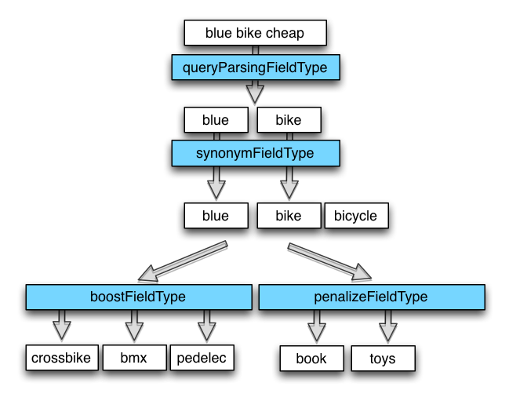

The boosting dismax query parser (bmax)
==================

A synonym aware edismax query parser for Apache Solr. The bmax query parser relies on
field types and tokenizer chains to parse the user query, discovers synonyms, boost 
and penalize terms at query time. Hence it is highly configurable. 

It does *not accept* any lucene query syntax (`~-+()`). The query composed is a dismax query 
with a minimum must match of 100%.

This document covers Version 1.5.x and onwards. For the old 0.9.9 version, [take a look at
the release branch](https://github.com/shopping24/solr-bmax-queryparser/blob/v0.9.8/README.md).

## Bmax query processing
Query processing in the bmax query parser is split into 2 steps:

1. First is retrieving and supplying boost and penalize terms. This is done in the
    `BmaxBoostTermComponent`
1. Second is parsing the incoming query and building an appropriate Lucene query.
   This is done in the `BmaxQueryParser`.

### 1. Retrieving boost and penalize terms
The incoming user query (`q`) is analyzed and boost terms are supplied in the `bq` parameter.
Penalize terms are added in the `rq` and `rqq` parameter to form a negative rerank query.
Boost and penalize term retrieval is done in 3 steps:

1. Run the incoming query in `q` through the configured `queryParsingFieldType`
1. Expand synonyms for each query token through `synonymFieldType`.
1. Retrieve boost and penalize terms for each token through
   `boostTermFieldType` and `penalizeTermFieldType` respectivly.

Given the example above with `q=blue bike cheap` the query parsing field type would
remove noise and leave `blue bike`. The synonym lookup would retrieve `bicycle` as
synonym for `bike` and append it: `blue bike bicylce`. This would be the input for
penalize and boost term discovery.

The discovered boost terms `crossbike bmx pedelec` are appended to the incoming query
as a boost query `bq={!dismax qf='...' mm=1 bq=''} crossbike bmx pedelec`. The discovered
penalize terms are appended as rerank query `rq={!rerank reRankQuery=$rqq reRankDocs=... reRankWeight=...}&rqq=...book OR toys ...`. The rerank query formulated is a boolean OR query.

### 2. Parsing the user query
The bmax query parser utilizes the `edismax` query parser to build it's query. It recognizes the well known `edismax` parameters:

* `q` – the main query
* `qf` – query fields (weighted)
* `bq` – the boost query (additive)
* `bf` – boost functions (additive)
* `boost` – boost functions (multiplicative)

Rerank queries are realized through the default Solr rerank postfilter. Query parsing
is done in 3 steps:

1. Run the incoming query in `q` through the configured `queryParsingFieldType`
1. Expand synonyms for each query token through `synonymFieldType`. Synoynms treated 
   as sematically equal to the source token.
1. Retrieve subtopic terms for each token and synonym through `subtopicFieldType`. 
   Subtopics are bound to the source token in the main query.

Given the example above with `q=blue bike cheap` the query parsing field type would
remove noise and leave the tokens `blue,bike`. The synonym lookup would retrieve `bicycle` as
synonym for `bike`: `blue,[bike,bicycle]`. Subtopic retrieval for each token creates:
`[blue,lavendel],[bike,bicycle,bmx,crossbike,roadbike]`.

The query constructed is always a `dismax` query with a minimum must match of `100%`. The
example above would create the following query:

    BooleanQuery(MUST) of
      DismaxQuery(MUST) of blue,lavendel
      DismaxQuery(MUST) of bike,bicycle,bmx,crossbike,roadbike

The boost query (if given) is appended.

## Installing the component

* Place the [`solr-bmax-queryparser-<VERSION>-jar-with-dependencies.jar`](https://github.com/shopping24/solr-bmax-queryparser/releases) in the `/lib` 
  directory of your Solr installation. 
* Configure at least one field type in your `schema.xml` that can be used for query parsing and tokenizing
* Configure the `bmax` query parser in your `solrconfig.xml` (see below)
* Configure the `bmax.booster` search component in your `solrconfig.xml` (see below)
* Enable the `bmax` query parser using the `defType=bmax` parameter in your query.

This project is also vailable from Maven Central:

    <dependency>
        <groupId>com.s24.search.solr</groupId>
        <artifactId>solr-bmax-queryparser</artifactId>
        <version>1.5.0</version>
        <classifier>jar-with-dependencies</classifier>
    </dependency>

## Configuring the query parser

Add the `BmaxQParserPlugin` to the list of query parsers configured in your `solrconfig.xml`. It takes the following configuration parameters:

    <queryParser name="bmax" class="com.s24.search.solr.query.bmax.BmaxQParserPlugin">
        <!-- use this field type's query analyzer to tokenize the query -->
        <str name="queryParsingFieldType">bmax_query</str>

        <!-- further field types for synonyms and subtopics -->
        <str name="synonymFieldType">bmax_synonyms</str>
        <str name="subtopicFieldType">bmax_subtopics</str>
    </queryParser>

Configure the boost term component as follows:

    <searchComponent name="bmax.booster" class="com.s24.search.solr.component.BmaxBoostTermComponent">
        <!-- use the same as in query parser -->
        <str name="queryParsingFieldType">bmax_query</str>
        <str name="synonymFieldType">bmax_synonyms</str>
        
        <!-- boost and penalize term retrieval -->
        <str name="boostTermFieldType">bmax_boostterms</str>
        <str name="penalizeTermFieldType">bmax_penalizeterms</str>
    </searchComponent>
    
and add it to the components of your search handler in front of the query 
component:

    <requestHandler name="/select" class="solr.SearchHandler" default="true">
     <arr name="components">
         ...
         <str>bmax.booster</str>
         ...
      </arr>
    </requestHandler>

## Configuring the fieldTypes needed

A simple example for a field type in your `schema.xml`, that tokenizes a incoming query and removes stopwords might be this:

    <fieldType name="bmax_query" class="solr.TextField" indexed="false" stored="false">
        <analyzer type="query">
            <tokenizer class="solr.PatternTokenizerFactory" 
                       pattern="[+;:,\s©®℗℠™&amp;()/\p{Punct}&lt;&gt;»«]+" />
                                       
            <!-- lower case -->
            <filter class="solr.LowerCaseFilterFactory" />
            
            <!-- Removes stopwords from the query. -->
            <filter class="solr.StopFilterFactory" 
                    words="stopwords.txt" ignoreCase="true"/>
        </analyzer>
    </fieldType>

This is a example of a synonym parser. The input is each token of the query analyzer above, one at a time. So, there's no need for any fancy tokenizing, the keyword tokenizer will do it. This analyzer chain utilizes the `SynonymFilter` and as a last step removes all non-synonyms. With this nifty little trick, no unneeded synonyms get added to your query.

    <fieldType name="bmax_synonyms" class="solr.TextField" indexed="false" stored="false">
         <analyzer type="query">
            <tokenizer class="solr.KeywordTokenizerFactory" />
            
            <!-- synonyms -->
            <filter class="solr.SynonymFilterFactory" synonyms="syn.txt" ignoreCase="true" expand="false"/>

            <!-- remove all non-synonyms -->
            <filter class="solr.TypeTokenFilterFactory" types="list_tokentype_synonym.txt" useWhitelist="true"/>
         </analyzer>
      </fieldType>

For the boostterm field type, the `SynonymFilter` might be handy as well.

## Using the query parser
Use the following url parameters to manipulate the boost component and query parser:

### Boost component params
* `bmax.booster` (boolean) - enable/disable boost term component Default is `false`.
* `bmax.booster.boost` (boolean) - enable/disable boost term resolution. Default is `true`.
* `bmax.booster.penalize` (boolean) - enable/disable penalize term resolution. Default is `true`.
* `bmax.booster.boost.factor` (float) - boost factor that is multiplied to the boosts given in the `qf` paramter. Default is `1.0`.
* `bmax.booster.boost.extra` (String) - comma separated extra boost terms. Great to check new ideas.
* `bmax.booster.penalize.factor` (float) - Penalize factor that is used as negative weight in the rerank query. Default is `100.0`.
* `bmax.booster.penalize.docs` (int) - The number of documents to penalize from the begin of the result set.. Default is `400`.
* `bmax.booster.penalize.extra` (String) - comma separated extra penalize terms. Great to check new ideas.

### Query parser params
The query params used reflect the Solr edismax query parser.

* `q` (string) – the user query. *Lucene query syntax is not supported.*
* `qf` (string) – [the query fields with their weights](https://cwiki.apache.org/confluence/display/solr/The+DisMax+Query+Parser#TheDisMaxQueryParser).
* `bq` (string) – [additive boost query](https://cwiki.apache.org/confluence/display/solr/The+DisMax+Query+Parser#TheDisMaxQueryParser) 
* `bf` (string) – [additive boost functions](https://cwiki.apache.org/confluence/display/solr/The+DisMax+Query+Parser#TheDisMaxQueryParser)
* `tie` (string) – [the dismax tie breaker](https://cwiki.apache.org/confluence/display/solr/The+DisMax+Query+Parser#TheDisMaxQueryParser). Default is `0.0`.
* `boost` (string) – [multiplicative boost functions](https://cwiki.apache.org/confluence/display/solr/The+Extended+DisMax+Query+Parser)
* `bmax.synonym.boost` (float) – The term boost to be multiplicated with the boost defined in the `qf` parameter for synonym terms. Default is `0.1`. 
* `bmax.subtopic.boost`  (float) – The term boost to be multiplicated with the boost defined in the `qf` parameter for subtopic terms. Default is `0.01`. 

### Experimental parser params
This version leverages a experimental feature called term inspection. Before adding a term query clause to the main query or the boost query, the term inspection cache is checked, whether the term exists in the field term values.

* `bmax.inspect` (boolean) – Use the local term inspection cache to validate term query clauses. Default is `false`.
* `bmax.inspect.build` (boolean) – Build a local term inspection cache using the given `qf`. Default is `false`
* `bmax.inspect.maxterms` (integer) – Max numbers of distinct field terms to include a field in the term inspection cache. Default is `4096`. 

In order to use the feature, create a custom Solr cache `bmax.fieldTermCache`. The cache entries will be saved as [Dictomaton FSTs](https://github.com/danieldk/dictomaton) in order to consume as less heap as possible.

## Building the project

This should install the current version into your local repository

    $ mvn clean install
    
### Releasing the project to maven central
    
Define new versions
    
    $ export NEXT_VERSION=<version>
    $ export NEXT_DEVELOPMENT_VERSION=<version>-SNAPSHOT
    $ export JAVA_HOME="$(/usr/libexec/java_home -v 1.7.0)" && java -version

Then execute the release chain

    $ mvn org.codehaus.mojo:versions-maven-plugin:2.0:set -DgenerateBackupPoms=false -DnewVersion=$NEXT_VERSION
    $ git commit -a -m "pushes to release version $NEXT_VERSION"
    $ mvn -P release
    
Then, increment to next development version:
    
    $ git tag -a v$NEXT_VERSION -m "`curl -s http://whatthecommit.com/index.txt`"
    $ mvn org.codehaus.mojo:versions-maven-plugin:2.0:set -DgenerateBackupPoms=false -DnewVersion=$NEXT_DEVELOPMENT_VERSION
    $ git commit -a -m "pushes to development version $NEXT_DEVELOPMENT_VERSION"
    $ git push origin tag v$NEXT_VERSION && git push origin

## Contributing

We're looking forward to your comments, issues and pull requests!

## License

This project is licensed under the [Apache License, Version 2](http://www.apache.org/licenses/LICENSE-2.0.html).
