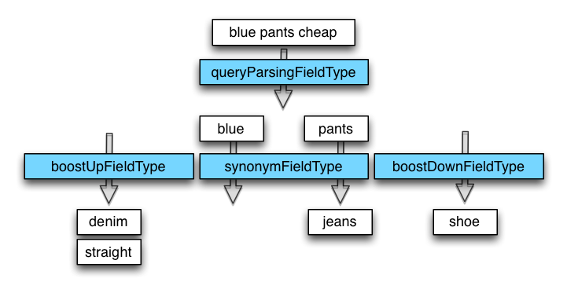

The boosting dismax query parser (bmax)
==================

A boosting dismax query parser for Apache Solr. The bmax query parser relies on
field types and tokenizer chains to parse the user query, discover synonyms, boost 
and penalize terms at query time. Hence it is highly configurable. It does *not accept* any lucene query syntax (`~-+()`). The query composed is a dismax query with a minimum must match of 100%.

## bmax query processing

Query processing in the bmax query parser is split into 2 steps. First is parsing and tokenizing the input query. Second is synonym and boost term lookup.

Query processing is done via Solr query `Analyzer`s configured in `FieldTypes` in your `schema.xml`. Die field types to use for query processing are part of the query parser configuration in your `solrconfig.xml`.

### 1. Parsing the user query

The contents of the `q` parameter are stuffed into the query analyzer of the configured `queryParsingFieldType`. The configured tokenizer tokenizes the input string and the configured analyzer could be used to remove stopwords (see example below).

### 2. Discovering synonyms (optional)

Each token emitted from the `queryParsingFieldType`s query analyzer is placed in the `synonymFieldType` (if configured). Use the field's query analyzer to look up synonyms (see below). 

### 3. Discovering boost and penalize terms (optional)

The tokens emitted from the `queryParsingFieldType`s query analyzer are also put into the `boostUpFieldType` and the `boostDownFieldType` to discover boost terms. In contrast to synonyms, boost terms are not used to widen the search result, they are used to do a boosting or penalizing inside the result documents.

### Building the query

The tokens extracted from the configured field types are composed into a single lucene query.

--> synonyms

--> boost up terms (weight)

--> rerank

## Installing the component

* Place the [`solr-bmax-queryparser-<VERSION>-jar-with-dependencies.jar`](https://github.com/shopping24/solr-bmax-queryparser/releases) in the `/lib` 
  directory of your Solr installation. 
* Configure at least one field type in your `schema.xml` that can be used for query parsing and tokenizing
* Configure the `bmax` query parser in your `solrconfig.xml` (see below)
* Enable the `bmax` query parser using the `defType=bmax` parameter in your query.

## Configuring the query parser

Add the `BmaxQParserPlugin` to the list of query parsers configured in your `solrconfig.xml`. It takes the following configuration parameters:

    <queryParser name="bmax" class="com.s24.search.solr.query.bmax.BmaxQParserPlugin">
        <!-- use this field type's query analyzer to tokenize the query -->
        <str name="queryParsingFieldType">bmax_query</str>

        <!-- further field types for synonyms and boostterms -->
        <str name="synonymFieldType">bmax_synonyms</str>
        <str name="boostUpFieldType">bmax_boostterms</str>
        <str name="boostDownFieldType">bmax_penalizeterms</str>
    </queryParser>
 
A simple example for a field type in your `schema.xml`, that tokenizes a incoming query and removes stopwords might be this:

    <fieldType name="bmax_query" class="solr.TextField" indexed="false" stored="false">
        <analyzer type="query">
            <tokenizer class="solr.PatternTokenizerFactory" 
                       pattern="[+;:,\s©®℗℠™&amp;()/\p{Punct}&lt;&gt;»«]+" />
                                       
            <!-- lower case -->
            <filter class="solr.LowerCaseFilterFactory" />
            
            <!-- Removes stopwords from the query. -->
            <filter class="solr.StopFilterFactory" 
                    words="stopwords.txt" ignoreCase="true"/>
        </analyzer>
    </fieldType>

This is a example of a synonym parser. The input is each token of the query analyzer above, one at a time. So, there's no need for any fancy tokenizing, the keyword tokenizer will do it. This analyzer chain utilizes the `SynonymFilter` and as a last step removes all non-synonyms. With this nifty little trick, no unneeded synonyms get added to your query.

    <fieldType name="bmax_synonyms" class="solr.TextField" indexed="false" stored="false">
         <analyzer type="query">
            <tokenizer class="solr.KeywordTokenizerFactory" />
            
            <!-- synonyms -->
            <filter class="solr.SynonymFilterFactory" synonyms="syn.txt" ignoreCase="true" expand="false"/>

            <!-- remove all non-synonyms -->
            <filter class="solr.TypeTokenFilterFactory" types="list_tokentype_synonym.txt" useWhitelist="true"/>
         </analyzer>
      </fieldType>

For the boostterm field type, the `SynonymFilter` might be handy as well.

## Using the query parser

    bmax.manipulateDocumentFrequencies
    bmax.manipulateTermFrequencies

## Building the project

This should install the current version into your local repository

    $ export MAVEN_OPTS="-Dmaven.wagon.http.ssl.insecure=true -Dmaven.wagon.http.ssl.allowall=true -Dmaven.wagon.http.ssl.ignore.validity.dates=true"
    $ mvn clean install
    
### Releasing the project to maven central
    
Define new versions
    
    $ export NEXT_VERSION=<version>
    $ export NEXT_DEVELOPMENT_VERSION=<version>-SNAPSHOT

Then execute the release chain

    $ mvn org.codehaus.mojo:versions-maven-plugin:2.0:set -DgenerateBackupPoms=false -DnewVersion=$NEXT_VERSION
    $ git commit -a -m "pushes to release version $NEXT_VERSION"
    $ mvn -P release
    
Then, increment to next development version:
    
    $ git tag -a v$NEXT_VERSION -m "`curl -s http://whatthecommit.com/index.txt`"
    $ mvn org.codehaus.mojo:versions-maven-plugin:2.0:set -DgenerateBackupPoms=false -DnewVersion=$NEXT_DEVELOPMENT_VERSION
    $ git commit -a -m "pushes to development version $NEXT_DEVELOPMENT_VERSION"
    $ git push origin tag v$NEXT_VERSION && git push origin

## License

This project is licensed under the [Apache License, Version 2](http://www.apache.org/licenses/LICENSE-2.0.html).
